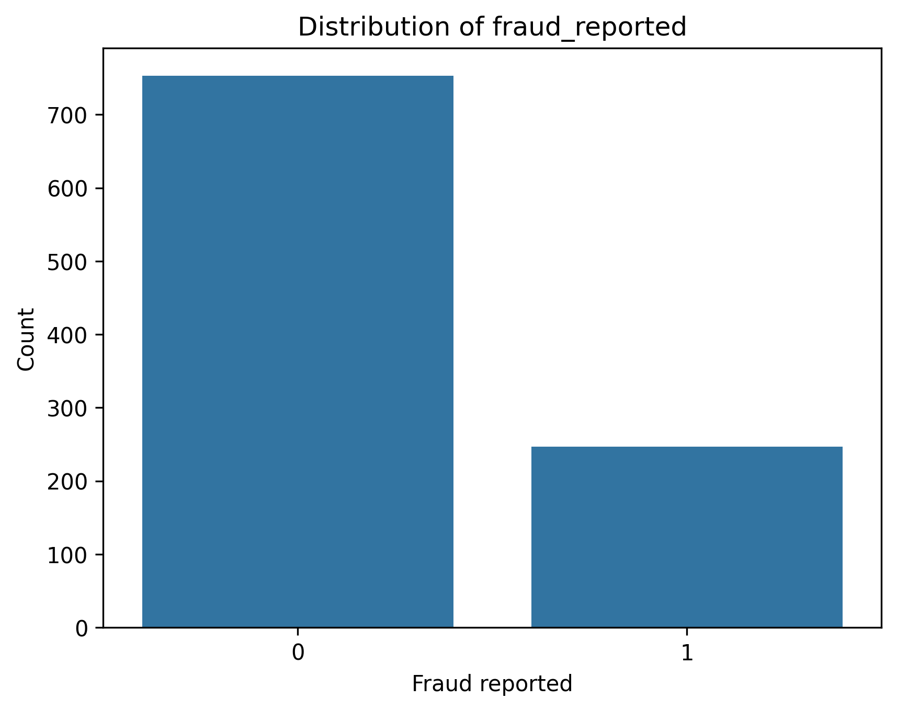
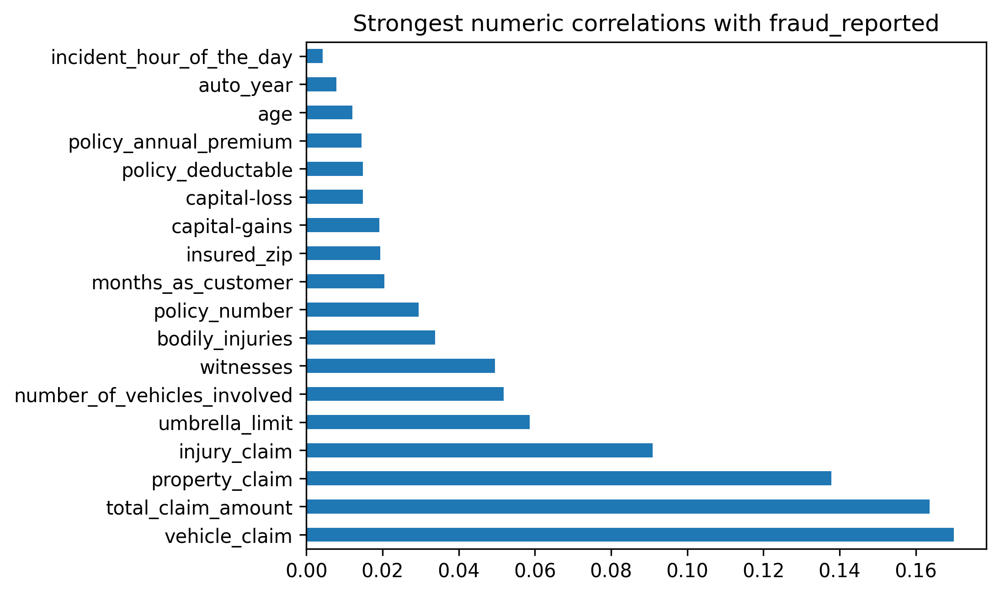
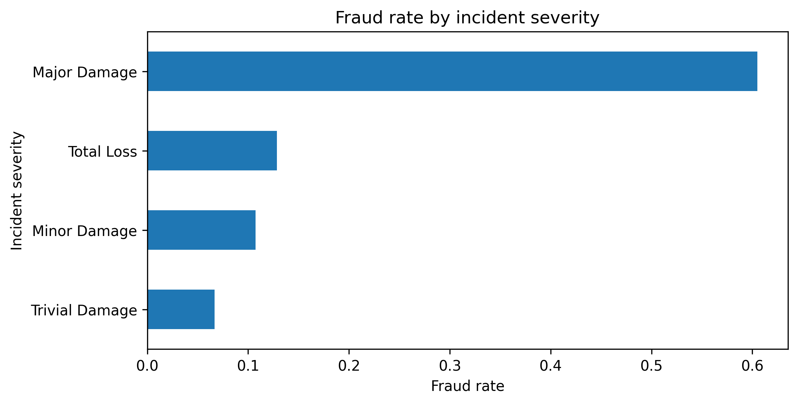
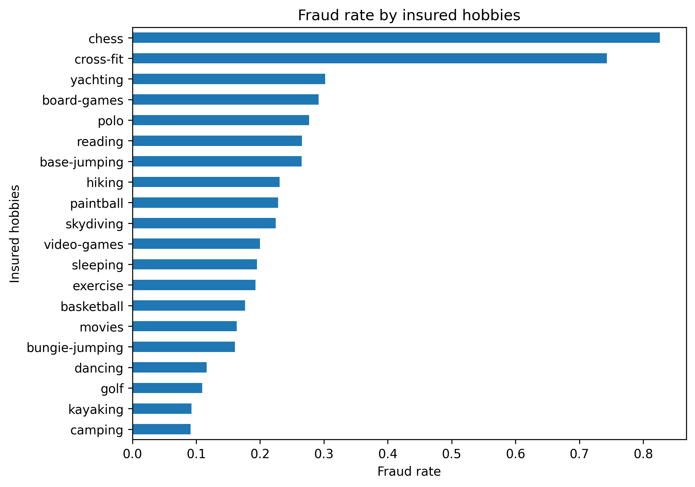
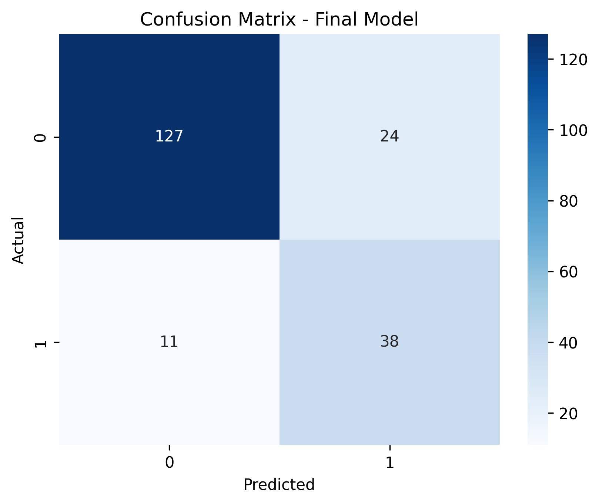
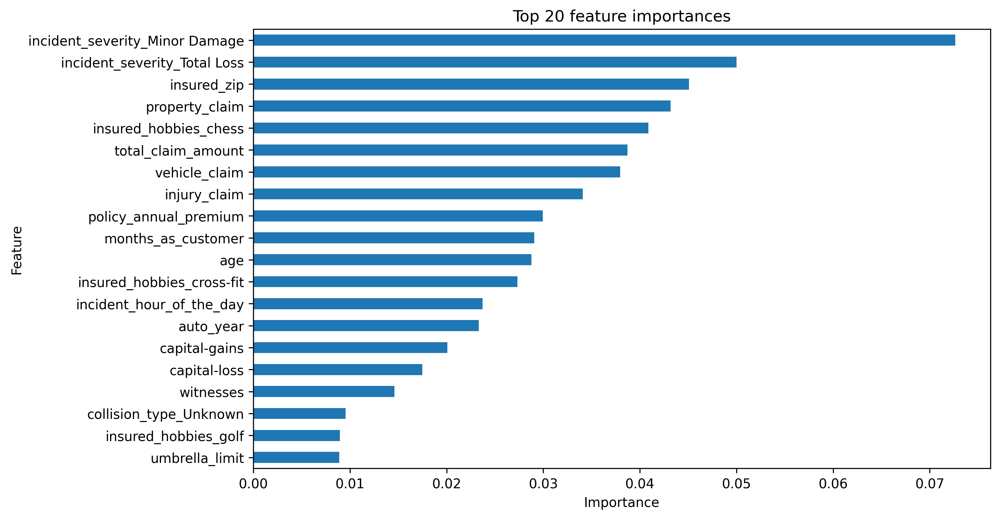

# Insurance Fraud Detection

## Project Overview

This project focuses on detecting fraudulent insurance claims using machine learning.

The goal is to build a binary classification model that predicts whether an insurance claim is fraudulent or non-fraudulent based on customer, policy, incident, vehicle, and claim-related information.

The target variable is:

```text
fraud_reported
```

where:

```text
0 = non-fraud
1 = fraud
```

Fraud detection is an imbalanced classification problem. Because fraudulent claims occur less frequently than non-fraudulent claims, this project focuses not only on accuracy, but also on precision, recall, F1-score, and the confusion matrix, especially for the fraud class.

---

## Dataset

The project uses the `insurance_claims.csv` dataset.

The dataset contains information about:

- insurance policy details
- customer characteristics
- incident details
- claim amounts
- vehicle information
- whether fraud was reported

The original target variable `fraud_reported` contained values `Y` and `N`, which were converted into binary values:

```text
Y -> 1
N -> 0
```

---

## Project Structure

```text
insurance-fraud-detection/
│
├── data/
│   └── insurance_claims.csv
│
├── images/
│   ├── target_distribution.png
│   ├── numeric_correlations.png
│   ├── fraud_by_incident_severity.png
│   ├── fraud_by_hobbies.png
│   ├── confusion_matrix.png
│   └── feature_importance.png
│
├── insurance_fraud_detection.ipynb
├── README.md
├── requirements.txt
└── .gitignore
```

---

## Technologies Used

- Python
- Pandas
- NumPy
- Matplotlib
- Seaborn
- Scikit-learn
- Jupyter Notebook

---

## Workflow

The project follows a typical machine learning workflow:

1. Data loading
2. Initial data exploration
3. Data cleaning
4. Exploratory data analysis
5. Categorical feature encoding
6. Train-test split
7. Random Forest model training
8. Class imbalance handling
9. Decision threshold tuning
10. Model evaluation
11. Feature importance analysis

---

## Data Cleaning

The following cleaning steps were performed:

- removed the empty `_c39` column
- converted `fraud_reported` from `Y/N` into `1/0`
- filled missing value in `authorities_contacted`
- replaced `?` values with `Unknown`
- removed columns with very high uniqueness or low modeling value:
  - `policy_number`
  - `policy_bind_date`
  - `incident_date`
  - `incident_location`

Some categorical columns, such as `incident_location` and `policy_bind_date`, produced artificially high fraud-rate differences because they contained many unique values. These columns were not treated as meaningful predictors.

---

## Exploratory Data Analysis

Exploratory data analysis was used to understand the relationship between available features and fraud.

The main findings were:

- numerical correlations with the target variable were generally weak
- categorical variables showed stronger differences in fraud rate
- `incident_severity` was one of the strongest categorical predictors
- `insured_hobbies` also showed clear differences in fraud rate
- claim amount variables such as `total_claim_amount`, `vehicle_claim`, and `property_claim` were relevant for the model

### Target Distribution

The target variable was imbalanced, with non-fraud cases appearing more often than fraud cases.



### Numeric Correlations

Numerical features showed relatively weak linear correlation with the target variable.



### Fraud Rate by Incident Severity

The `incident_severity` variable showed a strong relationship with fraud. Claims classified as `Major Damage` had a much higher fraud rate than other severity levels.



### Fraud Rate by Insured Hobbies

The `insured_hobbies` variable also showed strong differences in fraud rate. Some categories, especially `chess` and `cross-fit`, had a much higher fraud rate than the rest.



---

## Data Preprocessing

Before model training, categorical variables were converted into numerical format using one-hot encoding:

```python
pd.get_dummies()
```

The data was split into input features and target variable:

```python
X = df_model.drop(columns=["fraud_reported"])
y = df_model["fraud_reported"]
```

A stratified train-test split was used to preserve the original class distribution in both training and test sets.

---

## Model Training

The final model was a Random Forest Classifier.

Because the dataset was imbalanced, class weights were adjusted to make the model pay more attention to the fraud class:

```python
RandomForestClassifier(
    random_state=42,
    class_weight={0: 1, 1: 4}
)
```

---

## Threshold Tuning

The default classification threshold of `0.5` missed too many fraud cases.

Several thresholds were tested:

```text
0.5, 0.4, 0.35, 0.3, 0.25, 0.2
```

The best trade-off between fraud recall and precision was achieved with:

```text
threshold = 0.3
```

Lowering the threshold made the model more sensitive to fraud cases, improving recall for the fraud class.

---

## Final Model Performance

Final model configuration:

```python
RandomForestClassifier(
    random_state=42,
    class_weight={0: 1, 1: 4}
)
```

Final decision threshold:

```text
0.3
```

The final model achieved approximately:

```text
Accuracy: 0.82

Fraud class:
Precision: 0.61
Recall: 0.78
F1-score: 0.68
```

The model detected 38 out of 49 fraud cases in the test set.

### Confusion Matrix



---

## Feature Importance

Feature importance was used to interpret which variables contributed most to the Random Forest model.

The most important features were mainly related to:

- incident severity
- claim amount variables
- customer and policy information
- selected categorical variables such as insured hobbies



---

## Key Takeaways

Accuracy alone is not enough for fraud detection because the dataset is imbalanced.

The most important evaluation metrics are:

- recall for the fraud class
- precision for the fraud class
- F1-score
- confusion matrix

In this project, recall was especially important because missing a fraudulent claim may be more costly than generating a false alarm.

The final model achieved a good balance between detecting fraud cases and limiting false positives.

---

## How to Run the Project

Clone the repository:

```bash
git clone https://github.com/nograt/insurance-fraud-detection.git
```

Go to the project directory:

```bash
cd insurance-fraud-detection
```

Install required libraries:

```bash
pip install -r requirements.txt
```

Run Jupyter Notebook:

```bash
jupyter notebook
```

Open:

```text
insurance_fraud_detection.ipynb
```

---

## Requirements

The main required libraries are:

```text
pandas
numpy
matplotlib
seaborn
scikit-learn
jupyter
```

---

## Conclusion

This project demonstrates the full machine learning workflow for an imbalanced binary classification problem.

The final Random Forest model, combined with adjusted class weights and threshold tuning, was able to detect most fraudulent claims while keeping false positives at an acceptable level.

The project also shows that model evaluation should be adapted to the business problem. In fraud detection, recall and the confusion matrix are often more informative than accuracy alone.
